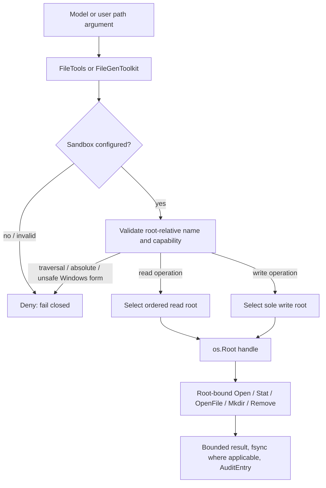

# Sandboxed File I/O Design

**Status:** implemented for `file.FileTools` and `filegen.FileGenToolkit`.

## Goal

Provide Agent-facing file access that is fail-closed, least-privilege, bounded,
auditable, and resistant to pathname escape. The design must preserve a legacy
unrestricted API for trusted programs while offering an explicit secure API for
paths supplied by models or users.

## Non-goals

This component is not an execution sandbox. It does not isolate a process,
limit network access, constrain CPU or memory, prevent bind-mount traversal, or
make an unsafe root safe. Deployment isolation remains a separate concern.

## Threat model

The path argument passed to a tool is untrusted. It may contain traversal,
absolute paths, platform-specific forms, symbolic-link paths, or race with an
attacker-controlled filesystem below a granted root. The service's sandbox
configuration and opened root directories are trusted inputs.

## Architecture



`*os.Root` is the enforcement boundary. The validation layer is retained for
portable input rules and useful error messages, but the toolkit does not return
to unrestricted `os.*` operations after validation.

## Capability model

- `WithReadRoots(...string)` grants read, directory listing, metadata lookup,
  and PPTX extraction below zero or more ordered roots.
- `WithWriteRoot(string)` grants writes, deletion, and directory creation below
  one root. It grants no read capability.
- A sandbox with no roots is valid and denies every operation.
- Reads default to 10 MiB and writes default to 5 MiB.
- `WithAllowOverwrite(true)` enables replacement for `WriteFile`; `CreateFile`
  additionally requires its `overwrite` argument to be true.
- `WithAudit(func(AuditEntry))` runs only after a successful operation.

## Public API

```go
sandbox, err := file.NewSandbox(
    file.WithReadRoots("./inputs", "./templates"),
    file.WithWriteRoot("./workspace"),
)

fileTools := file.NewWithSandbox(sandbox)
fileGenTools := filegen.NewWithSandbox(sandbox)
```

Agent-facing sandbox paths are root-relative. New APIs are:

- `Sandbox.ReadFile`, `ReadDir`, `Stat`, `WriteFile`, `DeleteFile`, `MkdirAll`,
  `CreateFile`, `CreateDirectory`, and `Close`;
- `file.NewWithSandbox` for general file operations;
- `filegen.NewWithSandbox` for generated files and directories.

`file.New()` and `filegen.New()` deliberately retain their unrestricted legacy
behavior for trusted callers. `file.NewWithBaseDir` adapts legacy absolute
in-root paths to the new root-bound mechanism.

## Path and filesystem rules

The sandbox rejects empty names, NUL bytes, absolute paths, volume-qualified
paths, and traversal outside the root. Windows paths additionally reject
rooted-relative forms, alternate-data-stream syntax, and reserved device names.

Root methods follow symbolic links only when the resolved target remains under
the opened root. The implementation also rejects a final symlink target for
writes as a defense against accidental replacement through a link. Root-bound
operations prevent an escaping link from reaching a file outside the root.

The final-link check is not a portable atomic no-follow primitive. A concurrent
process that can alter an allowed write root can swap an in-root entry after the
check. `*os.Root` still prevents that swap from escaping the root, but cannot
guarantee the identity of an in-root target; private roots or higher-level
locking are required when another writer is adversarial.

The native-platform guarantee does not apply to `GOOS=js`: Go documents a
symlink-validation TOCTOU limitation for `os.Root` there. Do not use this
component as a security boundary on that target.

For a write, parent directories are created one component at a time through
root-bound `Mkdir` and `OpenRoot` calls. New files use `O_CREATE|O_EXCL`.

## Overwrite semantics

Go 1.24 does not provide the root-bound atomic replacement primitive needed for
a portable atomic rename implementation. An explicitly authorized overwrite
therefore uses root-bound truncate-and-write semantics. If sync or close fails,
a newly created file is removed best effort; an existing file may already have
been modified. Critical artifact publication must use a higher-level staging and
promotion protocol.

## Lifecycle and concurrency

`os.Root` methods are safe for concurrent use. The sandbox configuration is
immutable after construction. Callers must keep the sandbox open until all tool
calls finish; closing a shared sandbox invalidates every toolkit that uses it.
Audit callbacks are caller code and must write to a concurrency-safe sink if
operations run concurrently.

## Test contract

Focused tests cover:

- fail-closed construction and read/write separation;
- relative-path enforcement, traversal, absolute paths, and Windows special
  path forms;
- external symbolic-link escapes and detected final symbolic links;
- read/write byte limits and parent creation;
- overwrite policy and audit recording;
- `filegen` root-relative creation, directory creation, dual overwrite opt-in,
  nil sandbox failure, and symbolic-link escape rejection.

Run:

```bash
go test ./pkg/hno/tools/file/... ./pkg/hno/tools/filegen/... -v
go vet ./pkg/hno/tools/file/... ./pkg/hno/tools/filegen/...
```

Race checks also require `CGO_ENABLED=1` and a working C compiler on Windows.

## Deployment requirements

For untrusted or multi-tenant workloads, pair this component with per-run or
per-tenant volumes, filesystem ACLs, a low-privilege service account, execution
isolation (container, VM, or runtime sandbox), resource quotas, egress control,
and durable auditing.
