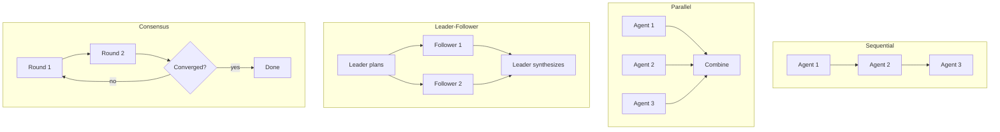

# Team - Multi-Agent Collaboration

Build powerful multi-agent systems with 4 coordination modes.

---

## What is Team?

A **Team** is a collection of agents working together to solve complex tasks. Different coordination modes enable various collaboration patterns.

### Key Features

- **4 Coordination Modes**: Sequential, Parallel, Leader-Follower, Consensus
- **Dynamic Membership**: Add/remove agents at runtime
- **Flexible Configuration**: Customize behavior per mode
- **Type-Safe**: Full Go type checking

---

## Creating a Team

### Basic Example

```go
package main

import (
    "context"
    "fmt"
    "log"

    "github.com/rexleimo/agno-go/pkg/hno/agent"
    "github.com/rexleimo/agno-go/pkg/hno/team"
    "github.com/rexleimo/agno-go/pkg/hno/models/openai"
)

func main() {
    // Create model
    model, _ := openai.New("gpt-4o-mini", openai.Config{
        APIKey: "your-api-key",
    })

    // Create team members
    researcher, _ := agent.New(agent.Config{
        Name:         "Researcher",
        Model:        model,
        Instructions: "You are a research expert.",
    })

    writer, _ := agent.New(agent.Config{
        Name:         "Writer",
        Model:        model,
        Instructions: "You are a technical writer.",
    })

    // Create team
    t, err := team.New(team.Config{
        Name:   "Content Team",
        Agents: []*agent.Agent{researcher, writer},
        Mode:   team.ModeSequential,
    })
    if err != nil {
        log.Fatal(err)
    }

    // Run team
    output, _ := t.Run(context.Background(), "Write about AI")
    fmt.Println(output.Content)
}
```

---

## Coordination Modes

Four collaboration strategies plug into the shared orchestration kernel as
`Scheduler` implementations:



### 1. Sequential Mode

Agents execute one after another, output feeds to next agent.

```go
t, _ := team.New(team.Config{
    Name:   "Pipeline",
    Agents: []*agent.Agent{agent1, agent2, agent3},
    Mode:   team.ModeSequential,
})
```

**Use Cases:**
- Content pipelines (research → write → edit)
- Data processing workflows
- Multi-step reasoning

**How it Works:**
1. Agent 1 processes input → Output A
2. Agent 2 processes Output A → Output B
3. Agent 3 processes Output B → Final Output

---

### 2. Parallel Mode

All agents execute simultaneously, results combined.

```go
t, _ := team.New(team.Config{
    Name:   "Multi-Perspective",
    Agents: []*agent.Agent{techAgent, bizAgent, ethicsAgent},
    Mode:   team.ModeParallel,
})
```

**Use Cases:**
- Multi-perspective analysis
- Parallel data processing
- Diverse opinions generation

**How it Works:**
1. All agents receive same input
2. Execute concurrently (Go goroutines)
3. Results combined into single output

---

### 3. Leader-Follower Mode

Leader delegates tasks to followers and synthesizes results.

```go
t, _ := team.New(team.Config{
    Name:   "Project Team",
    Leader: leaderAgent,
    Agents: []*agent.Agent{follower1, follower2},
    Mode:   team.ModeLeaderFollower,
})
```

**Use Cases:**
- Task delegation
- Hierarchical workflows
- Expert consultation

**How it Works:**
1. Leader analyzes task and creates subtasks
2. Delegates to appropriate followers
3. Synthesizes follower outputs into final result

---

### 4. Consensus Mode

Agents discuss until reaching agreement.

```go
t, _ := team.New(team.Config{
    Name:      "Decision Team",
    Agents:    []*agent.Agent{optimist, realist, critic},
    Mode:      team.ModeConsensus,
    MaxRounds: 3,  // Maximum discussion rounds
})
```

**Use Cases:**
- Decision making
- Quality assurance
- Debate and refinement

**How it Works:**
1. All agents provide initial opinions
2. Agents review others' opinions
3. Iterate until consensus or max rounds
4. Final consensus output

---

## Configuration

### Config Struct

```go
type Config struct {
    // Required
    Agents []*agent.Agent  // Team members

    // Optional
    Name      string              // Team name (default: "Team")
    Mode      CoordinationMode    // Coordination mode (default: Sequential)
    Leader    *agent.Agent        // Leader (for LeaderFollower mode)
    MaxRounds int                 // Max rounds (for Consensus mode, default: 3)
}
```

### Coordination Modes

```go
const (
    ModeSequential     CoordinationMode = "sequential"
    ModeParallel       CoordinationMode = "parallel"
    ModeLeaderFollower CoordinationMode = "leader-follower"
    ModeConsensus      CoordinationMode = "consensus"
)
```

---

## API Reference

### team.New

Create a new team instance.

**Signature:**
```go
func New(config Config) (*Team, error)
```

**Returns:**
- `*Team`: Created team instance
- `error`: Error if agents list is empty or invalid config

---

### Team.Run

Execute the team with input.

**Signature:**
```go
func (t *Team) Run(ctx context.Context, input string) (*RunOutput, error)
```

**Parameters:**
- `ctx`: Context for cancellation/timeout
- `input`: User input string

**Returns:**
```go
type RunOutput struct {
    Content      string                 // Final team output
    AgentOutputs []AgentOutput          // Individual agent outputs
    Metadata     map[string]interface{} // Additional metadata
}
```

---

### Team.AddAgent / RemoveAgent

Manage team members dynamically.

**Signatures:**
```go
func (t *Team) AddAgent(ag *agent.Agent)
func (t *Team) RemoveAgent(name string) error
func (t *Team) GetAgents() []*agent.Agent
```

**Example:**
```go
// Add new agent
t.AddAgent(newAgent)

// Remove agent by name
err := t.RemoveAgent("OldAgent")

// Get all agents
agents := t.GetAgents()
```

---

## Complete Examples

### Sequential Team Example

Content creation pipeline with research → analysis → writing.

```go
func createContentPipeline(apiKey string) {
    model, _ := openai.New("gpt-4o-mini", openai.Config{APIKey: apiKey})

    researcher, _ := agent.New(agent.Config{
        Name:         "Researcher",
        Model:        model,
        Instructions: "Research the topic and provide key facts.",
    })

    analyst, _ := agent.New(agent.Config{
        Name:         "Analyst",
        Model:        model,
        Instructions: "Analyze research findings and extract insights.",
    })

    writer, _ := agent.New(agent.Config{
        Name:         "Writer",
        Model:        model,
        Instructions: "Write a concise summary based on insights.",
    })

    t, _ := team.New(team.Config{
        Name:   "Content Pipeline",
        Agents: []*agent.Agent{researcher, analyst, writer},
        Mode:   team.ModeSequential,
    })

    output, _ := t.Run(context.Background(),
        "Write about the benefits of AI in healthcare")

    fmt.Println(output.Content)
}
```

### Parallel Team Example

Multi-perspective analysis with concurrent execution.

```go
func multiPerspectiveAnalysis(apiKey string) {
    model, _ := openai.New("gpt-4o-mini", openai.Config{APIKey: apiKey})

    techAgent, _ := agent.New(agent.Config{
        Name:         "Tech Specialist",
        Model:        model,
        Instructions: "Focus on technical aspects.",
    })

    bizAgent, _ := agent.New(agent.Config{
        Name:         "Business Specialist",
        Model:        model,
        Instructions: "Focus on business implications.",
    })

    ethicsAgent, _ := agent.New(agent.Config{
        Name:         "Ethics Specialist",
        Model:        model,
        Instructions: "Focus on ethical considerations.",
    })

    t, _ := team.New(team.Config{
        Name:   "Analysis Team",
        Agents: []*agent.Agent{techAgent, bizAgent, ethicsAgent},
        Mode:   team.ModeParallel,
    })

    output, _ := t.Run(context.Background(),
        "Evaluate the impact of autonomous vehicles")

    fmt.Println(output.Content)
}
```

---

## Best Practices

### 1. Choose the Right Mode

- **Sequential**: Use when output depends on previous steps
- **Parallel**: Use when perspectives are independent
- **Leader-Follower**: Use when task delegation is needed
- **Consensus**: Use when quality and agreement are critical

### 2. Agent Specialization

Give each agent clear, specific instructions:

```go
// Good ✅
Instructions: "You are a Python expert. Focus on code quality."

// Bad ❌
Instructions: "You help with coding."
```

### 3. Error Handling

Always handle errors from team operations:

```go
output, err := t.Run(ctx, input)
if err != nil {
    log.Printf("Team execution failed: %v", err)
    return
}
```

### 4. Context Management

Use context for timeouts and cancellation:

```go
ctx, cancel := context.WithTimeout(context.Background(), 60*time.Second)
defer cancel()

output, err := t.Run(ctx, input)
```

---

## Performance Considerations

### Parallel Execution

Parallel mode uses Go goroutines for true concurrency:

```go
// 3 agents execute simultaneously
t, _ := team.New(team.Config{
    Agents: []*agent.Agent{a1, a2, a3},
    Mode:   team.ModeParallel,
})

// Total time ≈ slowest agent (not sum of all)
```

### Memory Usage

Each agent maintains its own memory. For large teams:

```go
// Clear memory after each run
output, _ := t.Run(ctx, input)
for _, ag := range t.GetAgents() {
    ag.ClearMemory()
}
```

---

## Next Steps

- Learn about [Workflow](/guide/workflow) for step-based orchestration
- Explore [Models](/guide/models) for different LLM providers
- Add [Tools](/guide/tools) to enhance agent capabilities
- Check [Team API Reference](/api/team) for detailed API docs

---

## Related Examples

- [Team Demo](/examples/team-demo) - Full working example
- [Leader-Follower Pattern](/examples/team-demo#leader-follower)
- [Consensus Decision Making](/examples/team-demo#consensus)
