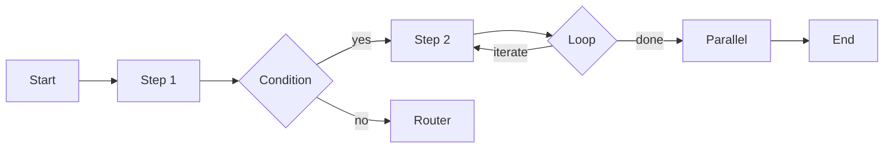

# Workflow - Step-Based Orchestration

Build complex, controlled multi-step processes with 5 powerful primitives.

---

## What is Workflow?

A **Workflow** provides deterministic, step-based orchestration for building controlled AI agent processes. Unlike Teams (autonomous), Workflows give you full control over execution flow.



### Key Features

- **5 Primitives**: Step, Condition, Loop, Parallel, Router
- **Deterministic Execution**: Predictable, repeatable flows
- **Full Control**: You decide the execution path
- **Context Sharing**: Pass data between steps
- **Composable**: Nest primitives for complex logic

---

## Creating a Workflow

### Basic Example

```go
package main

import (
    "context"
    "fmt"
    "log"

    "github.com/rexleimo/agno-go/pkg/hno/agent"
    "github.com/rexleimo/agno-go/pkg/hno/workflow"
    "github.com/rexleimo/agno-go/pkg/hno/models/openai"
)

func main() {
    model, _ := openai.New("gpt-4o-mini", openai.Config{
        APIKey: "your-api-key",
    })

    // Create agents
    fetchAgent, _ := agent.New(agent.Config{
        Name:  "Fetcher",
        Model: model,
        Instructions: "Fetch data about the topic.",
    })

    processAgent, _ := agent.New(agent.Config{
        Name:  "Processor",
        Model: model,
        Instructions: "Process and analyze the data.",
    })

    // Create workflow steps
    step1, _ := workflow.NewStep(workflow.StepConfig{
        ID:    "fetch",
        Agent: fetchAgent,
    })

    step2, _ := workflow.NewStep(workflow.StepConfig{
        ID:    "process",
        Agent: processAgent,
    })

    // Create workflow
    wf, _ := workflow.New(workflow.Config{
        Name:  "Data Pipeline",
        Steps: []workflow.Node{step1, step2},
    })

    // Run workflow
    result, _ := wf.Run(context.Background(), "AI trends")
    fmt.Println(result.Output)
}
```

---

## Workflow Primitives

### 1. Step

Execute an agent or custom function.

```go
// With agent
step, _ := workflow.NewStep(workflow.StepConfig{
    ID:    "analyze",
    Agent: analyzerAgent,
})

// With custom function
step, _ := workflow.NewStep(workflow.StepConfig{
    ID: "transform",
    Function: func(ctx *workflow.ExecutionContext) (*workflow.StepOutput, error) {
        input := ctx.Input
        // Custom logic
        return &workflow.StepOutput{Output: transformed}, nil
    },
})
```

**Use Cases:**
- Agent execution
- Custom data transformation
- API calls
- Data validation

---

### 2. Condition

Conditional branching based on context.

```go
condition, _ := workflow.NewCondition(workflow.ConditionConfig{
    ID: "check_sentiment",
    Condition: func(ctx *workflow.ExecutionContext) bool {
        result := ctx.GetStepOutput("classify")
        return strings.Contains(result.Output, "positive")
    },
    ThenStep: positiveHandlerStep,
    ElseStep: negativeHandlerStep,
})
```

**Use Cases:**
- Sentiment routing
- Quality checks
- Error handling
- A/B testing logic

---

### 3. Loop

Iterative execution with exit conditions.

```go
loop, _ := workflow.NewLoop(workflow.LoopConfig{
    ID: "retry",
    Condition: func(ctx *workflow.ExecutionContext) bool {
        result := ctx.GetStepOutput("attempt")
        return result == nil || strings.Contains(result.Output, "error")
    },
    Body:          retryStep,
    MaxIterations: 5,
})
```

**Use Cases:**
- Retry logic
- Iterative refinement
- Data processing loops
- Progressive improvement

---

### 4. Parallel

Execute multiple steps concurrently.

```go
parallel, _ := workflow.NewParallel(workflow.ParallelConfig{
    ID: "gather_data",
    Steps: []workflow.Node{
        sourceStep1,
        sourceStep2,
        sourceStep3,
    },
})
```

**Use Cases:**
- Parallel data gathering
- Multi-source aggregation
- Independent computations
- Performance optimization

---

### 5. Router

Dynamic routing to different branches.

```go
router, _ := workflow.NewRouter(workflow.RouterConfig{
    ID: "route_by_type",
    Routes: map[string]workflow.Node{
        "email": emailHandlerStep,
        "chat":  chatHandlerStep,
        "phone": phoneHandlerStep,
    },
    Selector: func(ctx *workflow.ExecutionContext) string {
        if strings.Contains(ctx.Input, "@") {
            return "email"
        }
        return "chat"
    },
})
```

**Use Cases:**
- Input type routing
- Language detection
- Priority handling
- Dynamic dispatch

---

## Execution Context

The ExecutionContext provides access to workflow state.

### Methods

```go
type ExecutionContext struct {
    Input string  // Workflow input
}

// Get output from a previous step
func (ctx *ExecutionContext) GetStepOutput(stepID string) *StepOutput

// Store custom data
func (ctx *ExecutionContext) SetData(key string, value interface{})

// Retrieve custom data
func (ctx *ExecutionContext) GetData(key string) interface{}
```

### Example

```go
step := workflow.NewStep(workflow.StepConfig{
    ID: "use_context",
    Function: func(ctx *workflow.ExecutionContext) (*workflow.StepOutput, error) {
        // Access previous step
        previous := ctx.GetStepOutput("classify")

        // Access shared data
        userData := ctx.GetData("user_info")

        // Process and return
        result := processData(previous.Output, userData)
        return &workflow.StepOutput{Output: result}, nil
    },
})
```

---

## Complete Examples

### Conditional Workflow

Sentiment-based routing.

```go
func buildSentimentWorkflow(apiKey string) *workflow.Workflow {
    model, _ := openai.New("gpt-4o-mini", openai.Config{APIKey: apiKey})

    classifier, _ := agent.New(agent.Config{
        Name:  "Classifier",
        Model: model,
        Instructions: "Classify sentiment as 'positive' or 'negative'.",
    })

    positiveHandler, _ := agent.New(agent.Config{
        Name:  "PositiveHandler",
        Model: model,
        Instructions: "Thank the user warmly.",
    })

    negativeHandler, _ := agent.New(agent.Config{
        Name:  "NegativeHandler",
        Model: model,
        Instructions: "Apologize and offer help.",
    })

    classifyStep, _ := workflow.NewStep(workflow.StepConfig{
        ID:    "classify",
        Agent: classifier,
    })

    positiveStep, _ := workflow.NewStep(workflow.StepConfig{
        ID:    "positive",
        Agent: positiveHandler,
    })

    negativeStep, _ := workflow.NewStep(workflow.StepConfig{
        ID:    "negative",
        Agent: negativeHandler,
    })

    condition, _ := workflow.NewCondition(workflow.ConditionConfig{
        ID: "route",
        Condition: func(ctx *workflow.ExecutionContext) bool {
            result := ctx.GetStepOutput("classify")
            return strings.Contains(result.Output, "positive")
        },
        ThenStep: positiveStep,
        ElseStep: negativeStep,
    })

    wf, _ := workflow.New(workflow.Config{
        Name:  "Sentiment Router",
        Steps: []workflow.Node{classifyStep, condition},
    })

    return wf
}
```

### Loop Workflow

Retry with quality improvement.

```go
func buildRetryWorkflow(apiKey string) *workflow.Workflow {
    model, _ := openai.New("gpt-4o-mini", openai.Config{APIKey: apiKey})

    generator, _ := agent.New(agent.Config{
        Name:  "Generator",
        Model: model,
        Instructions: "Generate creative content.",
    })

    validator, _ := agent.New(agent.Config{
        Name:  "Validator",
        Model: model,
        Instructions: "Check if content meets quality standards. Return 'pass' or 'fail'.",
    })

    generateStep, _ := workflow.NewStep(workflow.StepConfig{
        ID:    "generate",
        Agent: generator,
    })

    validateStep, _ := workflow.NewStep(workflow.StepConfig{
        ID:    "validate",
        Agent: validator,
    })

    loop, _ := workflow.NewLoop(workflow.LoopConfig{
        ID: "improve",
        Condition: func(ctx *workflow.ExecutionContext) bool {
            result := ctx.GetStepOutput("validate")
            return result != nil && strings.Contains(result.Output, "fail")
        },
        Body:          generateStep,
        MaxIterations: 3,
    })

    wf, _ := workflow.New(workflow.Config{
        Name:  "Quality Loop",
        Steps: []workflow.Node{generateStep, validateStep, loop},
    })

    return wf
}
```

---

## Best Practices

### 1. Clear Step IDs

Use descriptive step IDs for debugging:

```go
// Good ✅
ID: "fetch_user_data"

// Bad ❌
ID: "step1"
```

### 2. Error Handling

Handle errors at each step:

```go
result, err := wf.Run(ctx, input)
if err != nil {
    log.Printf("Workflow failed at step: %v", err)
    return
}
```

### 3. Context Timeout

Set reasonable timeouts:

```go
ctx, cancel := context.WithTimeout(context.Background(), 5*time.Minute)
defer cancel()

result, _ := wf.Run(ctx, input)
```

### 4. Loop Limits

Always set MaxIterations to prevent infinite loops:

```go
loop, _ := workflow.NewLoop(workflow.LoopConfig{
    // ...
    MaxIterations: 10,  // Always set a limit
})
```

---

## Advanced Workflow Features

### Resume From Checkpoints

Restart an interrupted workflow from the last successful step:

```go
execCtx, err := wf.Run(ctx, input, "session-id",
    workflow.WithResumeFrom("validate-output"),
)
if err != nil {
    log.Fatal(err)
}
```

When `EnableHistory` is set on the workflow config, every run persists step outputs and cancellation records. Passing `WithResumeFrom(stepID)` skips previously completed steps and continues from the target checkpoint.

### Cancellation Persistence

Enable history to capture cancellation reasons, run IDs, and timestamps:

```go
store := workflow.NewMemoryStorage(100)
wf, _ := workflow.New(workflow.Config{
    Name:          "retriable-pipeline",
    Steps:         []workflow.Node{firstStep, finalStep},
    EnableHistory: true,
    HistoryStore:  store,
})
```

If a step cancels the context, the latest history entry records the `RunStatusCancelled` status plus `CancellationReason`. You can inspect it via `store.GetSession(ctx, sessionID)`.

### Media Payloads

Attach images, audio, or files to a run without embedding them in the prompt:

```go
// import "github.com/rexleimo/agno-go/pkg/hno/media"
attachments := []media.Attachment{
    {Type: "image", URL: "https://example.com/diagram.png"},
    {Type: "file",  ID:  "spec-v1", Name: "spec.pdf"},
}

execCtx, _ := wf.Run(ctx, "review this", "sess-media",
    workflow.WithMediaPayload(attachments),
)

payload, _ := execCtx.GetSessionState("media_payload")
```

The workflow stores the validated attachments in session state (`media_payload`), making them accessible to every step and downstream AgentOS integrations.

---

## Workflow vs Team

When to use each:

### Use Workflow When:
- You need deterministic execution
- Steps must happen in specific order
- You need fine-grained control
- Debugging and testing are critical

### Use Team When:
- Agents should work autonomously
- Order doesn't matter (parallel/consensus)
- You want emergent behavior
- Flexibility over control

---

## Performance Tips

### Parallel Execution

Use Parallel for independent steps:

```go
// Sequential: 3 seconds total
steps := []workflow.Node{step1, step2, step3} // 1s + 1s + 1s

// Parallel: 1 second total
parallel, _ := workflow.NewParallel(workflow.ParallelConfig{
    Steps: []workflow.Node{step1, step2, step3}, // max(1s, 1s, 1s)
})
```

### Context Reuse

Avoid redundant LLM calls by reusing context data:

```go
func (ctx *ExecutionContext) {
    // Cache expensive computation
    if ctx.GetData("cached") == nil {
        expensive := computeExpensiveData()
        ctx.SetData("cached", expensive)
    }
}
```

---

## Next Steps

- Compare with [Team](/guide/team) for autonomous agents
- Add [Tools](/guide/tools) to workflow agents
- Explore [Models](/guide/models) for different LLM providers
- Check [Workflow API Reference](/api/workflow) for detailed docs

---

## Related Examples

- [Workflow Demo](/examples/workflow-demo) - Full examples
- [Conditional Routing](/examples/workflow-demo#conditional)
- [Retry Loop Pattern](/examples/workflow-demo#loop)
